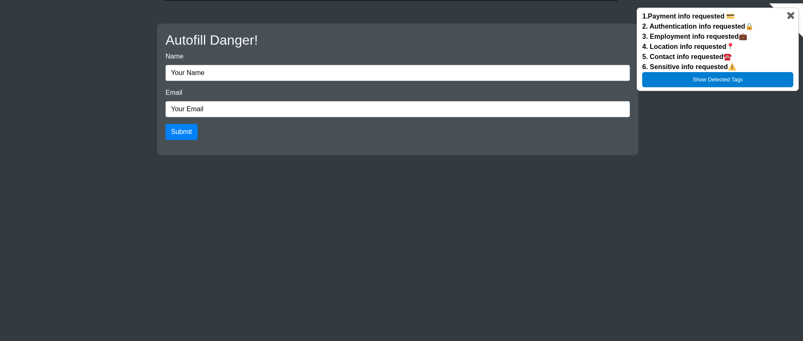
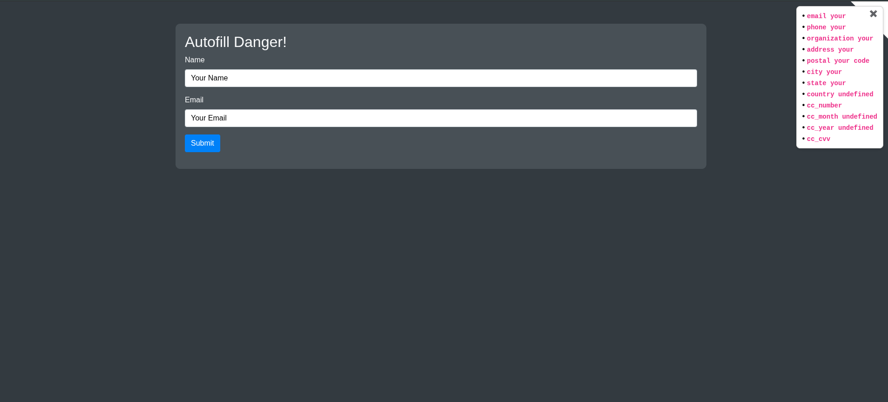

# 🔍 Hidden Data Collection Detector

> *Because you deserve a seat at the negotiation table when it comes to handing over your data!*

---

## Why This Exists

It started with a post by [Ryan Montgomery](https://www.linkedin.com/posts/rapper_how-autofill-can-steal-your-personal-information-ugcPost-7215066702416408576-OTbU/?utm_source=share&utm_medium=member_desktop&rcm=ACoAAB839rcBjSvXXJjsQ3yylg1_EqngQQ5_Wps) about the dangers of autofill. Honestly,the realization hit: so much could be happening in the background, silently, without us ever knowing. Data being read, fields being tracked, inputs being harvested (all while we're just trying to fill out a form for our convienience).

So instead of just feeling uneasy about it, this extension was built to **remove the abstraction**. To bring what's happening in the background into plain view, so that at the very least, you know what's going on when websites are reaching for your data. You deserve to be informed before deciding what to hand over and what to keep!

---

## 📸 See It In Action

&nbsp;

## 🚀 Installation

Never loaded an unpacked browser extension before? Not a problem! It's genuinely easier than it sounds. Pick your browser below and follow along.

---

### Google Chrome

1. Download or clone this repository to your computer.
2. Open Chrome and navigate to `chrome://extensions`.
3. Toggle on **Developer mode** in the top-right corner.
4. Click **"Load unpacked"**.
5. Select the folder containing this extension's files.
6. The extension will appear in your toolbar — you're good to go!

---

### Mozilla Firefox

1. Download or clone this repository to your computer.
2. Open Firefox and navigate to `about:debugging#/runtime/this-firefox`.
3. Click **"Load Temporary Add-on..."**.
4. Navigate to the extension folder and select the `manifest.json` file.
5. The extension is now active for your current Firefox session.

> **Note:** Firefox requires re-loading temporary extensions after each browser restart. For a permanent install, the extension would need to be submitted to the Firefox Add-on store.

---

### Microsoft Edge

1. Download or clone this repository to your computer.
2. Open Edge and navigate to `edge://extensions`.
3. Toggle on **Developer mode** in the left sidebar.
4. Click **"Load unpacked"**.
5. Select the folder containing this extension's files.
6. The extension will appear in your toolbar — ready to use!

---

### Brave

1. Download or clone this repository to your computer.
2. Open Brave and navigate to `brave://extensions`.
3. Toggle on **Developer mode** in the top-right corner.
4. Click **"Load unpacked"**.
5. Select the folder containing this extension's files.
6. Done — the extension is now active.

---

### Opera

1. Download or clone this repository to your computer.
2. Open Opera and navigate to `opera://extensions`.
3. Toggle on **Developer mode** in the top-right corner.
4. Click **"Load unpacked"**.
5. Select the folder containing this extension's files.
6. The extension is now loaded and ready.

---

## 🎬 Prefer a Quick Visual Walkthrough?

If you've read about half of this and are thinking *"that's a lot of words"* — honestly, same. Here's a short video that walks through the whole setup process:

▶️ [Watch the Installation Walkthrough](https://www.youtube.com/watch?v=QUCAMNFrb2k)

---

## 📊 What to Expect

Once the extension is running, here's an example of the kind of output you'll see:

&nbsp;

The extension also gives you the option to **view the raw tag terms** — useful if you want to dig deeper into exactly what's being flagged and why. The repo also includes a demo video.

---

## 💬 Feedback

Hope you find this useful! And if you don't — please, be brutally honest. That's how this gets better.

The best place to reach me is **LinkedIn** (that's where I'm most active), but feel free to hit me up on any of my socials:

- 🔗 LinkedIn: [Your LinkedIn](xhttps://www.linkedin.com/in/jevaun-s-75b4a6127/)
- 🐦 Twitter/X: [Your Twitter](https://x.com/cyberjevii)

Seriously — if something's broken, confusing, or could be better, I want to hear it!

---

## 📄 License

MIT License

Copyright (c) 2026 Jevaun Smith

Permission is hereby granted, free of charge, to any person obtaining a copy
of this software and associated documentation files...

---

*Built with curiosity. Maintained with feedback.*
